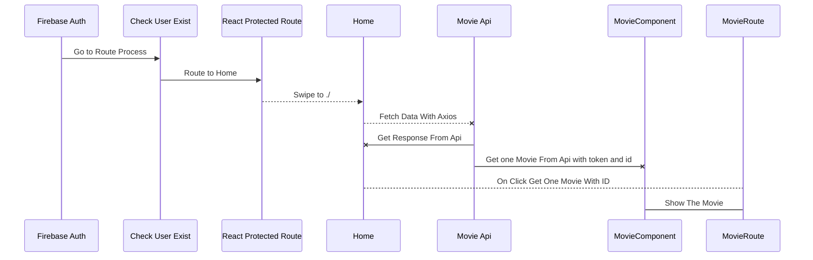
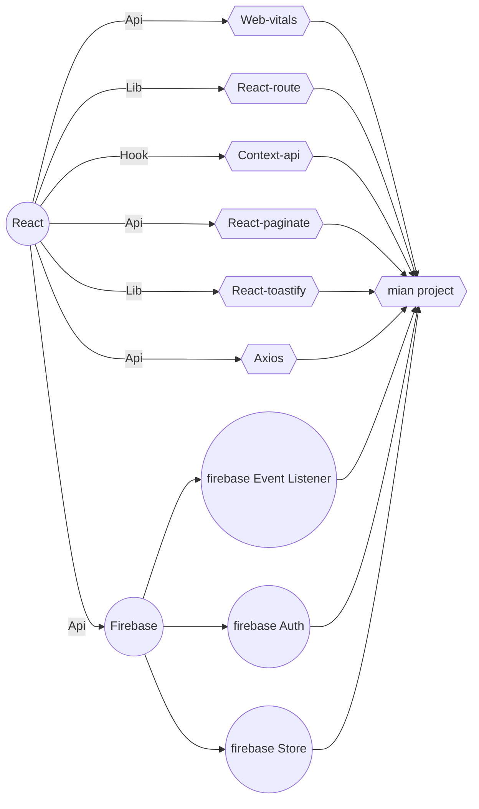

|Partition       | Technology                    
|----------------|-------------------------------|
|Ui/Ux Design    |`'I Used Figma to design components'`         
|Front End       |`"React with some React libraries"`    
|Back End        |`Firebase API`

## MOVZELA Diagrams

In this part you will see a simple diagram of the components of the project 

And this will produce a flow chart:

