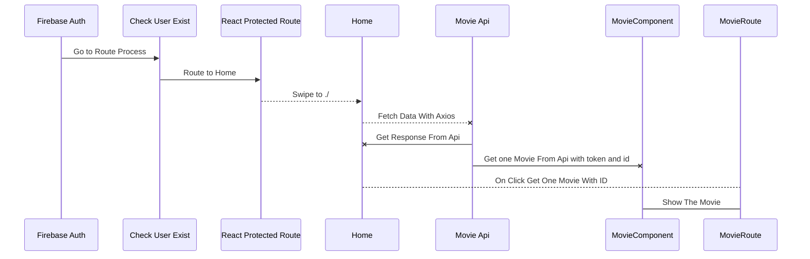

  

## Tools & Technology

| Tool/Technology | Description                                                                                    |
| --------------- | ---------------------------------------------------------------------------------------------- |
| Figma           |  |
| React           |  |
| VSCode          |  |
| CSS3            |  |
| Sass            |  |
| JavaScript      |  |
| HTML5           |  |
| Windows XP      |  |
| GitHub          |  |
| Google Chrome   |  |

| Partition      | Technology                            |
| -------------- | ------------------------------------- |
| Ui/Ux Design   | `'I Used Figma to design components'` |
| Front End      | `"React with some React libraries"`    |
| Back End       | `Firebase API`                         |

## [MOVZELA](https://movzila.web.app/) Diagrams

In this part, you will see a simple diagram of the components of the project:

### [MOVZELA](https://movzila.web.app/) Flow Chart:

Please note that the shields and badges may not display correctly on all platforms or Markdown viewers.
